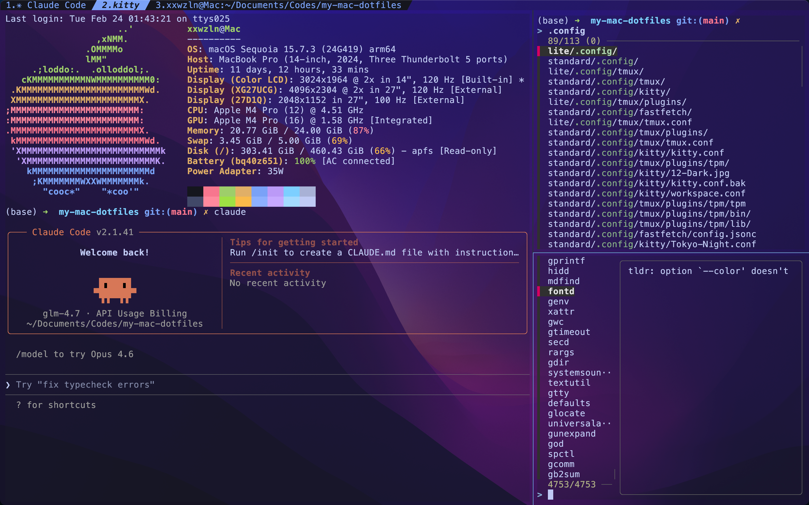

# xxw-dotfiles

Personal configuration files for macOS and Linux servers. This repository provides two editions:

- **Standard**: Full-featured configuration for macOS (requires sudo privileges)
- **Lite**: Minimal configuration for Linux servers (no sudo required)

## Standard Edition (macOS)

The standard edition includes all configurations with enhanced features for daily development.

### Prerequisites

Install required packages via Homebrew:

```bash
brew install tmux fzf tldr fastfetch yazi fnm
```

Install [Kitty terminal emulator](https://sw.kovidgoyal.net/kitty/).

### Installation

```bash
# Vim configuration
cp standard/.vimrc ~/.vimrc
cp -r standard/.vim ~/.vim

# Zsh configuration
cp standard/.zshrc ~/.zshrc

# Other configurations
cp -r standard/.config ~/.config
```

### Setup

1. **Tmux**: Load the configuration

   ```bash
   tmux source ~/.config/tmux/tmux.conf
   ```
2. **Kitty**: Reload preferences

   - macOS: `Ctrl + Cmd + ,`
   - Linux: `Ctrl + Shift + F5`
3. **Shell Tools**: fzf, tldr, yazi, and fnm are configured in `.zshrc`
4. **Fastfetch**: Configured in `.config/fastfetch` and `.config/kitty/kitty.conf` to display system info at shell startup

## Lite Edition (Linux Server)

The lite edition is designed for Linux servers without sudo privileges. It includes essential configurations for Vim and Tmux.

### Optional: Install Zsh

If Zsh is not installed:

1. Install Zsh following the [official guide](https://github.com/ohmyzsh/ohmyzsh/wiki/Installing-ZSH)
2. Install Oh My Zsh using a [mirror](https://mirrors.tuna.tsinghua.edu.cn/help/ohmyzsh.git/) for faster download in China

### Installation

```bash
# Vim configuration
cp lite/.vimrc ~/.vimrc
cp -r lite/.vim ~/.vim

# Zsh configuration (optional)
cp lite/.zshrc ~/.zshrc

# Other configurations
cp -r lite/.config ~/.config
```

### Setup

**Tmux**: Load the configuration

```bash
tmux source ~/.config/tmux/tmux.conf
```

## Features

<picture>
  <source media="(prefers-color-scheme: dark)" srcset="docs/kitty-screen-shot.png">
  
</picture>
<picture>
  <source media="(prefers-color-scheme: dark)" srcset="docs/tmux-screen-shot.png">
  
</picture>

- **Vim**: Basic settings with comment toggle plugin (`<Leader>cc` to comment, `<Leader>cu` to uncomment)
- **Tmux**: Custom keybindings with improved UI and interaction
- **Kitty**: Terminal emulator configuration (Standard edition only)
- **fzf**: Fuzzy search integration (Standard edition only)
  - `Ctrl + R`: Search command history
  - `Ctrl + T`: Search files
  - Tab completion for file paths (`/path/**`)
  - Tab completion for SSH hosts (`ssh **`)
- **tldr**: Simplified man pages (Standard edition only)
  - Aliased to `cman` (clever man)
  - `cmanview` lists all available manuals
- **yazi**: Visual file manager (Standard edition only)
- **fnm**: Fast Node.js version manager
- **fastfetch**: System info display at shell startup (Standard edition only)

## References

- https://www.bilibili.com/video/BV1jCkxBMEF4
- https://www.bilibili.com/video/BV1DdR8YEE9Z
- https://github.com/preservim/nerdcommenter
- https://github.com/junegunn/vim-plug
